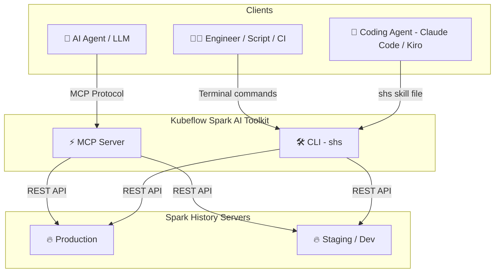
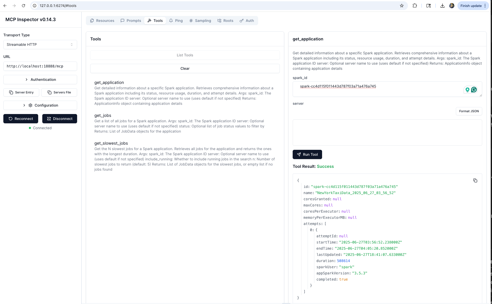
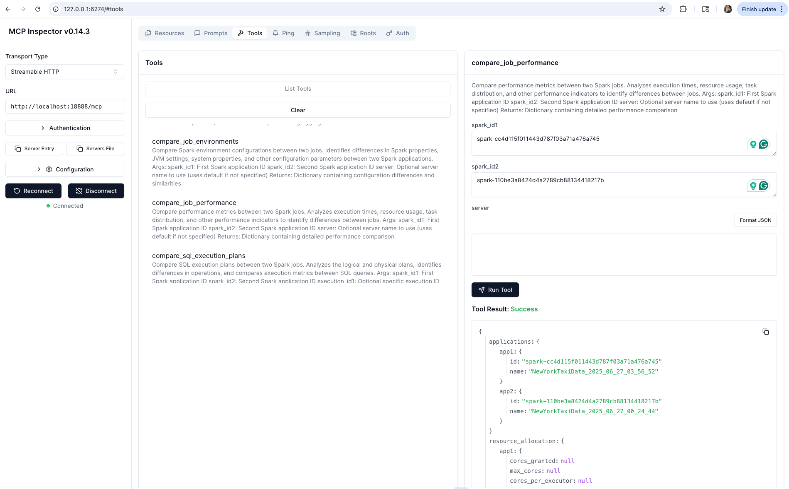

# Kubeflow Spark AI Toolkit

[](https://github.com/kubeflow/mcp-apache-spark-history-server/actions)
[](https://www.python.org/downloads/)
[](https://modelcontextprotocol.io/)
[](https://opensource.org/licenses/Apache-2.0)
[](https://github.com/kubeflow)
[](https://cloud-native.slack.com/archives/C09FRRM6QM7)

> **Connect AI agents and engineers to Apache Spark History Server for intelligent job analysis, performance monitoring, and investigation**

---

> [!IMPORTANT]
> ### ✨ NEW — Spark History Server CLI is now available
> [](skills/cli/README.md)
>
> A standalone Go binary that queries Spark History Server **directly from your terminal** — no MCP, no AI framework, no daemon process. Inspect jobs, compare runs, investigate failures, and script against the Spark REST API.
>
> **[Get started with the SHS CLI →](skills/cli/README.md)**

---


This project provides **two interfaces** to your Spark History Server data:

| | 🛠️ [SHS CLI (`shs`)](#️-shs-cli-shs--for-engineers--scripts) | ⚡ [MCP Server](#-mcp-server--for-ai-agents) |
|---|---|---|
| **For** | Engineers, shell scripts, CI/CD, coding agents | AI agents and MCP-compatible clients |
| **Mental model** | "I know the command I want to run" | "Agent, investigate this Spark app" |
| **Install** | Single static binary — no dependencies | Python 3.12+, uv |
| **Get started** | [CLI docs →](skills/cli/README.md) | [MCP docs →](#-mcp-server--for-ai-agents) |

📺 **See it in action:**
[](https://www.youtube.com/watch?v=e3P_2_RiUHw)

---

## 🏗️ Architecture



---

## 🛠️ SHS CLI (`shs`) — For Engineers & Scripts

A standalone Go binary — no MCP, no dependencies, no running daemon. Query your Spark History Server directly from the terminal, shell scripts, or CI/CD pipelines. Also works as a **skill** for coding agents like Claude Code and Kiro.

### Install

```bash
# Auto-detect latest version, OS, and architecture
VERSION=$(curl -s https://api.github.com/repos/kubeflow/mcp-apache-spark-history-server/releases | grep -m1 '"tag_name": "cli/' | cut -d'"' -f4 | sed 's|cli/||')
OS=$(uname -s | tr '[:upper:]' '[:lower:]')
ARCH=$(uname -m)
[ "$ARCH" = "x86_64" ] && ARCH="amd64"
[ "$ARCH" = "aarch64" ] && ARCH="arm64"

curl -sSL "https://github.com/kubeflow/mcp-apache-spark-history-server/releases/download/cli%2F${VERSION}/shs-${VERSION}-${OS}-${ARCH}.tar.gz" | tar xz
sudo mv shs /usr/local/bin/
```

### Quick Start

```bash
# Generate a config file
shs setup config > config.yaml   # then set your Spark History Server URL

# Explore applications
shs apps
shs jobs -a APP_ID --status failed
shs stages -a APP_ID --sort duration
shs compare apps --app-a APP1 --app-b APP2

# Use as a skill with Claude Code or Kiro
shs setup skill > ~/.claude/skills/spark-history.md
```

**[CLI documentation](skills/cli/README.md)** for full usage, or check out a [real-world example](skills/cli/examples/compare/README.md) of Claude Code comparing two **TPC-DS 3TB benchmark** runs.

---

## ⚡ MCP Server — For AI Agents

An [MCP (Model Context Protocol)](https://modelcontextprotocol.io/) server that exposes Spark History Server data as tools for AI agents. Agents query your Spark infrastructure using natural language — the server handles tool selection, multi-server routing, and structured data retrieval.

**Use the MCP server when** you want an AI agent to conduct multi-step investigations, synthesize findings across tools, or answer natural-language questions about your Spark applications.

### Install

```bash
# Run directly with uvx (no install needed)
uvx --from mcp-apache-spark-history-server spark-mcp

# Or install with pip
pip install mcp-apache-spark-history-server
spark-mcp
```

The package is published to [PyPI](https://pypi.org/project/mcp-apache-spark-history-server/).

### Configure

Edit `config.yaml`:

```yaml
servers:
  local:
    default: true
    url: "http://your-spark-history-server:18080"
    auth:            # optional
      username: "user"
      password: "pass"
    include_plan_description: false   # include SQL plans by default (default: false)
mcp:
  transports:
    - streamable-http   # or: stdio
  port: "18888"
  debug: false
```

Environment variable overrides:

```
SHS_MCP_PORT          Port for MCP server (default: 18888)
SHS_MCP_TRANSPORT     Transport mode: streamable-http or stdio
SHS_MCP_DEBUG         Enable debug mode (default: false)
SHS_MCP_ADDRESS       Bind address (default: localhost)
SHS_SERVERS_*_URL     URL for a specific server
SHS_SERVERS_*_AUTH_USERNAME
SHS_SERVERS_*_AUTH_PASSWORD
SHS_SERVERS_*_AUTH_TOKEN
SHS_SERVERS_*_VERIFY_SSL
SHS_SERVERS_*_TIMEOUT
SHS_SERVERS_*_EMR_CLUSTER_ARN
SHS_SERVERS_*_INCLUDE_PLAN_DESCRIPTION
```

### Multi-Server Setup

Configure multiple Spark History Servers and route queries to specific ones:

```yaml
servers:
  production:
    default: true
    url: "http://prod-spark-history:18080"
    auth:
      username: "user"
      password: "pass"
  staging:
    url: "http://staging-spark-history:18080"
```

Agents can target a specific server per query:

> *"Get application `<app_id>` from the production server"*

### Connect an AI Agent

| Agent | Transport | Guide |
|-------|-----------|-------|
| **Claude Desktop** | stdio | [Setup →](examples/integrations/claude-desktop/) |
| **Amazon Q CLI** | stdio | [Setup →](examples/integrations/amazon-q-cli/) |
| **Kiro** | streamable-http | [Setup →](examples/integrations/kiro/) |
| **LangGraph** | streamable-http | [Setup →](examples/integrations/langgraph/) |
| **Strands Agents** | streamable-http | [Setup →](examples/integrations/strands-agents/) |
| **Local / Inspector** | streamable-http | [Setup →](TESTING.md) |

### Available Tools (19)

#### Application Information
| Tool | Description |
|------|-------------|
| `list_applications` | List applications with optional status, date, and limit filters |
| `get_application` | Get application detail: status, resources, duration, attempts |

#### Job Analysis
| Tool | Description |
|------|-------------|
| `list_jobs` | List jobs with status filtering |
| `list_slowest_jobs` | Top N slowest jobs |

#### Stage Analysis
| Tool | Description |
|------|-------------|
| `list_stages` | List stages with status filtering |
| `list_slowest_stages` | Top N slowest stages |
| `get_stage` | Stage detail with attempt and summary metrics |
| `get_stage_task_summary` | Task metric distributions (execution time, memory, I/O, spill) |

#### Executor & Resource Analysis
| Tool | Description |
|------|-------------|
| `list_executors` | List executors (active and optionally inactive) |
| `get_executor` | Executor detail: resources, task stats, performance |
| `get_executor_summary` | Aggregate metrics across all executors |
| `get_resource_usage_timeline` | Chronological executor add/remove with resource totals |

#### Configuration & Environment
| Tool | Description |
|------|-------------|
| `get_environment` | Spark config, JVM info, system properties, classpath |

#### SQL & Query Analysis
| Tool | Description |
|------|-------------|
| `list_slowest_sql_queries` | Top N slowest SQL executions with metrics |
| `get_sql_execution` | SQL execution detail with optional plan and node metrics |
| `compare_sql_execution_plans` | Compare SQL plans and metrics between two jobs |

#### Performance & Bottleneck Analysis
| Tool | Description |
|------|-------------|
| `get_job_bottlenecks` | Identify bottlenecks across stages, tasks, and executors |

#### Comparative Analysis
| Tool | Description |
|------|-------------|
| `compare_job_environments` | Diff Spark configs between two applications |
| `compare_job_performance` | Diff performance metrics between two applications |

#### Example Agent Queries
- *"Why is my ETL job running slower than yesterday?"* → `get_job_bottlenecks` + `list_slowest_stages` + `compare_job_performance`
- *"What caused job 42 to fail?"* → `list_jobs` + `get_stage` + `get_stage_task_summary`
- *"Compare today's batch with yesterday's run"* → `compare_job_performance` + `compare_job_environments`
- *"Find my slowest SQL queries and explain why"* → `list_slowest_sql_queries` + `get_sql_execution` + `compare_sql_execution_plans`

---

## 📸 Screenshots

### 🔍 Get Spark Application


### ⚡ Job Performance Comparison


---

## 🚀 Kubernetes Deployment

Deploy the MCP server using Helm:

```bash
helm install spark-history-mcp ./deploy/kubernetes/helm/mcp-apache-spark-history-server/

# Production configuration
helm install spark-history-mcp ./deploy/kubernetes/helm/mcp-apache-spark-history-server/ \
  --set replicaCount=3 \
  --set autoscaling.enabled=true
```

See [`deploy/kubernetes/helm/`](deploy/kubernetes/helm/) for full configuration options.

When deployed in Kubernetes, connect Claude Desktop via `mcp-remote`:
```bash
kubectl port-forward svc/mcp-apache-spark-history-server 18888:18888
```

---

## 📔 AWS Integration

- **[AWS Glue](examples/aws/glue/README.md)** — Connect to Glue Spark History Server
- **[Amazon EMR](examples/aws/emr/README.md)** — Use EMR Persistent UI for Spark analysis

---

## 🔧 Development Setup

```bash
git clone https://github.com/kubeflow/mcp-apache-spark-history-server.git
cd mcp-apache-spark-history-server

# Install Task runner
brew install go-task   # macOS; see https://taskfile.dev/installation/ for others

# MCP Server
task install           # install Python dependencies
task start-spark-bg    # start Spark History Server with sample data
task start-mcp-bg      # start MCP server
task start-inspector-bg  # open MCP Inspector at http://localhost:6274
task stop-all

# CLI
cd skills/cli
task build             # build ./bin/shs
task test              # unit tests
task test-e2e          # e2e tests (starts/stops Docker SHS automatically)
task start-shs         # start SHS with CLI e2e sample data
```

---

## 🌍 Adopters

Using this project? Add your organization to [ADOPTERS.md](ADOPTERS.md) and help grow the community.

## 🤝 Contributing

See [CONTRIBUTING.md](CONTRIBUTING.md) for guidelines.

## 📄 License

Apache License 2.0 — see [LICENSE](LICENSE).

## 📝 Trademark Notice

*Built for use with Apache Spark™ History Server. Not affiliated with or endorsed by the Apache Software Foundation.*

---

<div align="center">

**Connect your Spark infrastructure to AI agents and engineers**

[🛠️ SHS CLI](skills/cli/README.md) · [⚡ MCP Server](#-mcp-server--for-ai-agents) · [🧪 Test](TESTING.md) · [🤝 Contribute](#-contributing)

*Built by the community, for the community* 💙

</div>
