```mermaid
graph TB
    subgraph "Airflow Integration"
        A[📅 Airflow Scheduler] --> B[🔧 Custom MCP Operator]
        B --> C[📊 Daily Analysis DAG]
        C --> D[🚨 Optimization Alert DAG]
        D --> E[📧 Notification System]
    end

    subgraph "Enhanced Galaxi MCP Server"
        B --> F[⚡ Spark History Tools]
        F --> G[📈 Trend Analysis Engine]
        G --> H[🤖 ML Optimization Model]
        H --> I[💡 Recommendation Generator]
    end

    subgraph "Scheduled Workflows"
        C --> J[🔍 Performance Monitoring]
        C --> K[📊 Resource Utilization Analysis]
        C --> L[💰 Cost Optimization Review]
        
        J --> M[📄 Daily Performance Report]
        K --> N[📊 Resource Efficiency Report]
        L --> O[💰 Cost Savings Report]
    end

    style A fill:#e8f5e8
    style F fill:#f3e5f5
    style H fill:#fff3e0
```

```mermaid
graph TB
    subgraph "Data Lineage Platform"
        A[🔍 Lineage Collector] --> B[📊 Lineage Graph Engine]
        B --> C[🗂️ Metadata Repository]
        C --> D[🌐 Lineage Visualization]
        D --> E[📈 Impact Analysis Tool]
    end

    subgraph "Upstream Systems"
        F[🗃️ AWS Glue Jobs] --> A
        G[📊 Redshift Queries] --> A
        H[🔄 Lambda Functions] --> A
        I[📁 S3 Data Sources] --> A
    end

    subgraph "Spark Processing Layer"
        A --> J[⚡ Spark Applications]
        J --> K[📄 Spark Event Logs]
        K --> L[🔧 MCP Analysis Tools]
    end

    subgraph "Downstream Systems"
        J --> M[📊 Data Warehouses]
        J --> N[📈 Analytics Dashboards]
        J --> O[🤖 ML Pipelines]
        J --> P[📧 Reporting Systems]
    end

    subgraph "Lineage Insights"
        E --> Q[🚨 Change Impact Assessment]
        E --> R[🔍 Root Cause Analysis]
        E --> S[📊 Performance Correlation]
        E --> T[💡 Optimization Opportunities]
    end

    style B fill:#e1f5fe
    style J fill:#f3e5f5
    style E fill:#fff3e0
```

# Agentic Spark History MCP Server Implementation

## Executive Summary

This document presents two strategic implementation approaches for integrating Spark History Server MCP capabilities into the Galaxi ecosystem, enabling agentic AI-powered Spark analytics and optimization across DWAAS and Galaxi customer environments.

## Option 1: Immediate Implementation - Galaxi MCP Server Integration

### Implementation Steps

1. **Add Current Tools to Galaxi MCP Server**
   - Integrate 18 existing Spark History Server MCP tools
   - Maintain tool compatibility and API consistency
   - Enable seamless tool discovery and execution

2. **Add EMR Serverless Capability**
   - Implement EMR Serverless job monitoring and analysis
   - Add cost optimization recommendations for serverless workloads
   - Enable real-time performance tracking

3. **Package as Toolbox with One-Step Installation**
   - Create unified installation package
   - Customer configuration update for Spark History Server endpoints
   - Automated dependency management and validation

4. **Enable Spark Optimization Evaluation**
   - Implement before/after performance comparison
   - Provide quantitative optimization impact metrics
   - Generate actionable optimization recommendations

### Architecture Diagram - Option 1: Galaxi MCP Server Integration

```mermaid
graph TB
    subgraph "Customer Environment"
        A[🤖 AI Agents] --> B[📡 Enhanced Galaxi MCP Server]
        C[🛠️ Amazon Q CLI] --> B
        D[🌐 Claude Desktop] --> B
    end

    subgraph "Enhanced Galaxi MCP Server"
        B --> E[⚡ Spark History Tools]
        B --> F[🚀 EMR Serverless Tools]
        B --> G[🔗 Glue Integration]
        B --> H[📊 Redshift Analytics]
        
        E --> I[📈 Performance Analysis]
        E --> J[🚨 Bottleneck Detection]
        E --> K[🔄 Optimization Evaluation]
        
        F --> L[💰 Cost Optimization]
        F --> M[⚡ Serverless Monitoring]
    end

    subgraph "AWS Services"
        I --> N[🔥 Spark History Server]
        J --> N
        K --> N
        L --> O[🚀 EMR Serverless]
        M --> O
        G --> P[🗃️ AWS Glue]
        H --> Q[📊 Amazon Redshift]
    end

    subgraph "One-Step Installation"
        R[📦 Toolbox Package] --> B
        S[⚙️ Config Update] --> N
        T[🔧 Auto-Setup] --> O
    end

    style B fill:#e1f5fe
    style E fill:#f3e5f5
    style R fill:#e8f5e8
```



## Implementation Timeline & Technical Details

### Option 1: Immediate Implementation (4-6 weeks)

**Week 1-2: Core Integration**
```bash
# Integration tasks
- Merge existing MCP tools into Galaxi server codebase
- Implement EMR Serverless API integration
- Create unified configuration management system
```

**Week 3-4: Enhanced Capabilities**
```bash
# Enhancement tasks  
- Add Glue metadata correlation features
- Implement Redshift performance integration
- Develop optimization evaluation framework
```

**Week 5-6: Packaging & Deployment**
```bash
# Deployment tasks
- Create one-step installation package
- Implement customer configuration templates
- Deploy to customer environments
```

### Option 2: Future Implementation (6-8 months)

**Month 1-2: Infrastructure Foundation**
```bash
# Foundation tasks
- Set up centralized AWS account and IAM roles
- Implement cross-account access framework
- Design multi-tenant security architecture
```

**Month 3-4: Agentic Service Development**
```bash
# Service development
- Build intelligent MCP agent with Bedrock integration
- Implement historical log storage and analysis
- Create natural language query interface
```

**Month 5-6: Advanced Analytics**
```bash
# Analytics development
- Implement cross-customer benchmarking
- Build predictive performance models
- Create automated optimization recommendations
```

**Month 7-8: Customer Migration**
```bash
# Migration tasks
- Gradual customer onboarding process
- Legacy system integration and validation
- Performance tuning and optimization
```

### Advantages

1. **Automatic Functionality Reflection**
   - Any new tools or enhancements automatically propagate to all customer environments
   - Centralized updates ensure consistent feature availability
   - Reduced maintenance overhead for customers

2. **Enriched Analytics with Cross-Service Integration**
   - Enhanced capabilities through AWS Glue metadata integration
   - Redshift query performance correlation with Spark jobs
   - Unified data pipeline optimization across services

### Challenges & Mitigations

**Challenge**: Configuration complexity across multiple AWS services
**Mitigation**: Template-based configuration with environment-specific presets

**Challenge**: Version compatibility across different customer environments
**Mitigation**: Containerized deployment with dependency isolation

---

## Option 2: Future Implementation - Centralized Agentic Service

### Implementation Steps

1. **Create Centralized Account and Service**
   - Establish centralized AWS account with cross-account access
   - Implement service that can access all DWAAS and Galaxi customer accounts
   - Set up secure, role-based access management

2. **Integrate MCP to Centralized Service**
   - Connect MCP server to centralized analytics service
   - Implement multi-tenant data access and isolation
   - Enable unified API for all customer environments

3. **Create Agentic MCP Integration**
   - Develop intelligent agent that invokes MCP tools
   - Implement automated Spark History log analysis
   - Enable natural language query processing

4. **Integrate Bedrock for Historical Storage**
   - Store and analyze historical Spark execution logs
   - Implement AI-powered trend analysis and predictions
   - Enable long-term performance optimization insights

### Architecture Diagram - Option 2: Centralized Agentic Service

```mermaid
graph TB
    subgraph "Customer Environments"
        A1[🤖 DWAAS Customer A] --> B[🧠 Centralized Agentic Service]
        A2[🤖 Galaxi Customer B] --> B
        A3[🤖 DWAAS Customer C] --> B
    end

    subgraph "Centralized Agentic Platform"
        B --> C[🔐 Multi-Account Access Controller]
        C --> D[🤖 Intelligent MCP Agent]
        C --> E[📊 Cross-Account Aggregator]
        
        D --> F[🧠 Amazon Bedrock]
        D --> G[📈 Historical Analytics]
        D --> H[🔍 Pattern Recognition]
        
        E --> I[⚡ MCP Tool Orchestrator]
        I --> J[🛠️ Spark History MCP Tools]
    end

    subgraph "Customer Account A"
        J --> K1[🔥 Spark History Server A]
        E --> L1[🗃️ Glue Catalog A]
        K1 --> M1[📄 Event Logs A]
    end

    subgraph "Customer Account B"
        J --> K2[🔥 Spark History Server B]
        E --> L2[🗃️ Glue Catalog B]
        K2 --> M2[📄 Event Logs B]
    end

    subgraph "Customer Account C"
        J --> K3[🔥 Spark History Server C]
        E --> L3[🗃️ Glue Catalog C]
        K3 --> M3[📄 Event Logs C]
    end

    subgraph "Bedrock Integration"
        F --> N[🧠 LLM Analysis]
        G --> O[📊 Trend Prediction]
        H --> P[🔍 Anomaly Detection]
        G --> Q[🗄️ Historical Log Storage]
    end

    style B fill:#e1f5fe
    style D fill:#fff3e0
    style F fill:#f3e5f5
```



### Implementation Details

**Phase 1: Infrastructure Setup (Month 1-2)**
- Centralized service architecture design
- Multi-tenant security model implementation
- Cross-account IAM role configuration

**Phase 2: Data Aggregation (Month 3-4)**
- Spark History Server proxy development
- Historical data ingestion pipeline
- Bedrock integration for AI analysis

**Phase 3: Advanced Analytics (Month 5-6)**
- Cross-customer benchmarking (anonymized)
- Predictive performance modeling
- Automated optimization recommendations

**Phase 4: Customer Migration (Month 7-8)**
- Gradual customer onboarding
- Legacy system integration
- Performance validation and tuning

### Advantages (Detailed)

1. **Centralized Intelligence**
   - Cross-customer performance benchmarking (anonymized)
   - Industry-wide optimization patterns and best practices
   - Predictive analytics based on historical trends

2. **Advanced AI Capabilities**
   - Bedrock-powered natural language query interface
   - Automated anomaly detection across all customer environments
   - Intelligent resource allocation recommendations

3. **Operational Excellence**
   - Single point of maintenance and updates
   - Centralized monitoring and alerting
   - Consistent SLA across all customers

4. **Scalability & Cost Efficiency**
   - Shared infrastructure costs across customer base
   - Elastic scaling based on aggregate demand
   - Optimized resource utilization

### Challenges & Mitigations

**Challenge**: Complex multi-tenant security requirements
**Mitigation**: Zero-trust architecture with customer data isolation

**Challenge**: Cross-account access complexity
**Mitigation**: Standardized IAM role templates and automated setup

**Challenge**: Data sovereignty and compliance concerns
**Mitigation**: Regional deployment options and customer-controlled encryption

---

## Potential Enhancements

### 1. Airflow DAG Integration for Scheduled Optimization

**Implementation**: Integrate with Apache Airflow DAGs to provide daily/scheduled optimization suggestions based on historical Spark job performance patterns.

**Technical Components**:
- **Airflow Hook Integration**: Custom Airflow operators for MCP tool invocation
- **Scheduled Analysis**: Daily/weekly performance trend analysis
- **Automated Recommendations**: ML-driven optimization suggestions
- **DAG Performance Correlation**: Link Spark job performance with DAG execution patterns

**Architecture Enhancement**:



**Implementation Details**:
```python
# Custom Airflow Operator
class SparkOptimizationOperator(BaseOperator):
    def __init__(self, mcp_server_url, app_ids, **kwargs):
        super().__init__(**kwargs)
        self.mcp_server = mcp_server_url
        self.app_ids = app_ids
    
    def execute(self, context):
        # Invoke MCP tools for optimization analysis
        recommendations = self.analyze_spark_performance()
        self.send_optimization_alerts(recommendations)
```

### 2. End-to-End Data Lineage Implementation

**Implementation**: Implement comprehensive data lineage tracking across upstream and downstream systems when adopted by all pipeline components.

**Technical Components**:
- **Lineage Graph Construction**: Build complete data flow visualization
- **Cross-System Tracking**: Track data movement between Spark, Glue, Redshift, S3
- **Impact Analysis**: Understand downstream effects of Spark job changes
- **Dependency Mapping**: Visualize job dependencies and data relationships

**Architecture Enhancement**:



**Implementation Details**:
```python
# Lineage Integration
class DataLineageTracker:
    def __init__(self, mcp_client):
        self.mcp = mcp_client
        self.lineage_graph = NetworkGraph()
    
    def build_end_to_end_lineage(self, app_id):
        # Collect upstream dependencies
        upstream_jobs = self.get_upstream_dependencies(app_id)
        
        # Collect downstream consumers
        downstream_jobs = self.get_downstream_consumers(app_id)
        
        # Build complete lineage graph
        return self.construct_lineage_graph(upstream_jobs, app_id, downstream_jobs)
```

## Enhanced Architecture with Both Enhancements

```mermaid
graph TB
    subgraph "Scheduling & Orchestration"
        A[📅 Airflow Scheduler] --> B[🔧 MCP Optimization Operator]
        C[🔍 Lineage Collector] --> D[📊 Lineage Graph Engine]
    end

    subgraph "Enhanced Galaxi MCP Server"
        B --> E[⚡ Spark History Tools]
        D --> E
        E --> F[📈 Trend Analysis]
        E --> G[🌐 Lineage Analysis]
        E --> H[🤖 ML Optimization]
        
        F --> I[💡 Scheduled Recommendations]
        G --> J[🔍 Impact Analysis]
        H --> K[📊 Performance Insights]
    end

    subgraph "Data Pipeline Ecosystem"
        L[🗃️ Glue Jobs] --> C
        M[📊 Redshift] --> C
        N[⚡ Spark Jobs] --> E
        N --> O[📄 Event Logs]
        
        P[📈 Dashboards] --> C
        Q[🤖 ML Pipelines] --> C
    end

    subgraph "Automated Workflows"
        I --> R[📧 Daily Optimization Alerts]
        J --> S[🚨 Change Impact Notifications]
        K --> T[📊 Performance Reports]
    end

    style E fill:#e1f5fe
    style H fill:#fff3e0
    style D fill:#f3e5f5
```



## Strategic Decision Framework

### Implementation Priority Matrix

| Enhancement | Complexity | Customer Value | Implementation Time |
|-------------|------------|----------------|-------------------|
| **Airflow Integration** | Medium | High | 2-3 weeks |
| **End-to-End Lineage** | High | Very High | 4-6 weeks |
| **Combined Solution** | High | Maximum | 6-8 weeks |

### Phased Enhancement Approach

**Phase 1**: Core MCP Integration (Option 1)
- 4-6 weeks baseline implementation

**Phase 2**: Airflow Scheduling Enhancement
- Add daily/scheduled optimization suggestions
- Implement automated performance monitoring

**Phase 3**: Data Lineage Integration
- Build end-to-end flow tracking
- Enable impact analysis capabilities

**Phase 4**: Advanced Analytics Platform
- Combine all enhancements with Option 2 centralized service
- Full agentic capabilities with Bedrock integration

| Criteria | Option 1: Immediate | Option 2: Future |
|----------|-------------------|------------------|
| **Time to Market** | 4-6 weeks | 6-8 months |
| **Customer Impact** | Immediate value | Transformational |
| **Implementation Risk** | Low | Medium-High |
| **Scalability** | Customer-managed | Centralized |
| **AI Capabilities** | Basic integration | Advanced agentic |
| **Cross-customer Insights** | Limited | Comprehensive |
| **Maintenance Overhead** | Distributed | Centralized |

### Recommended Approach: Hybrid Strategy

1. **Phase 1**: Implement Option 1 for immediate customer value
2. **Phase 2**: Develop Option 2 as strategic evolution
3. **Phase 3**: Offer both deployment models based on customer needs

This approach maximizes short-term customer satisfaction while building toward an advanced agentic analytics platform.
