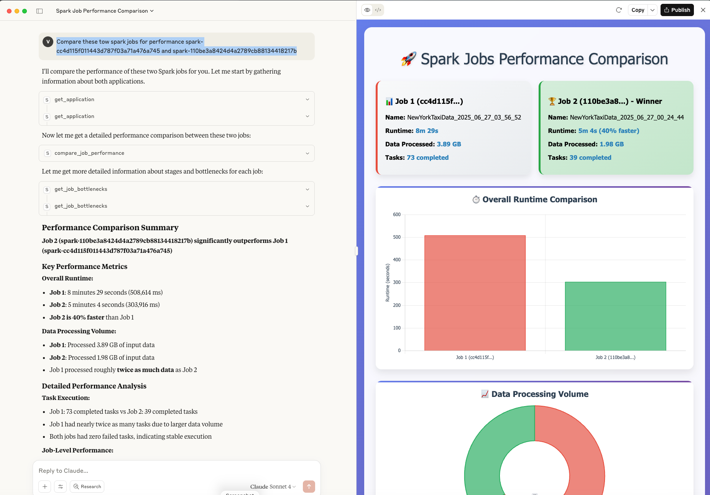

# Claude Desktop Integration

Connect Claude Desktop to Spark History Server for AI-powered job analysis.

## Prerequisites

1. **Clone and setup repository**:
```bash
git clone https://github.com/kubeflow/mcp-apache-spark-history-server.git
cd mcp-apache-spark-history-server

# Install Task (if not already installed)
brew install go-task  # macOS
# or see https://taskfile.dev/installation/ for other platforms

# Setup dependencies
task install
```

2. **Start Spark History Server with sample data**:
```bash
task start-spark-bg
# Starts server at http://localhost:18080 with 3 sample applications
```

3. **Verify setup**:
```bash
curl http://localhost:18080/api/v1/applications
# Should return 3 applications
```

## Setup

1. **Configure Claude Desktop** (`~/Library/Application Support/Claude/claude_desktop_config.json`):

```json
{
    "mcpServers": {
        "mcp-apache-spark-history-server": {
            "command": "uv",
            "args": [
                "run",
                "--from",
                "mcp-apache-spark-history-server",
                "spark-mcp",
            ],
            "env": {
                "SHS_MCP__TRANSPORT": "stdio"
            }
        }
    }
}
```

2. **Restart Claude Desktop**

## Test Connection

Ask Claude: "Are you connected to the Spark History Server? What tools are available?"

## Example Usage

```
Compare performance between these Spark applications:
- spark-cc4d115f011443d787f03a71a476a745
- spark-110be3a8424d4a2789cb88134418217b

Analyze execution times, bottlenecks, and provide optimization recommendations.
```



## Remote MCP Server (Kubernetes/EKS)

If the MCP server is deployed in Kubernetes using the [Helm chart](../../../deploy/kubernetes/helm/), Claude Desktop can connect to it over HTTP using `mcp-remote` as a bridge. No local Python or `uv` required — only Node.js.

> **Note**: Claude Desktop does not connect to remote MCP servers configured directly via the `"url"` field in `claude_desktop_config.json`. You must use `mcp-remote` or add the server via **Settings > Connectors** in the Claude Desktop UI. See [Claude's remote MCP server docs](https://support.claude.com/en/articles/11503834-building-custom-connectors-via-remote-mcp-servers) for details.

1. **Port-forward the MCP service**:

```bash
kubectl port-forward svc/mcp-apache-spark-history-server 18888:18888
```

2. **Configure Claude Desktop** (`~/Library/Application Support/Claude/claude_desktop_config.json`):

```json
{
    "mcpServers": {
        "mcp-apache-spark-history-server": {
            "command": "npx",
            "args": [
                "mcp-remote",
                "http://localhost:18888/mcp/"
            ]
        }
    }
}
```

3. **Restart Claude Desktop**

The MCP server in Kubernetes uses `streamable-http` transport by default. The `mcp-remote` tool bridges Claude Desktop's stdio transport to the remote HTTP endpoint.

**Note**: If you expose the MCP service via Ingress instead of port-forward, replace the URL with your Ingress endpoint (e.g., `https://spark-mcp.company.com/mcp/`).

## Remote Spark History Server (Local MCP)

If you want to run the MCP server locally but point it at a remote Spark History Server, edit `config.yaml` in the repository:

```yaml
servers:
  production:
    default: true
    url: "https://spark-history-prod.company.com:18080"
    auth:
      username: "user"
      password: "pass"
```

You can also use an SSH tunnel to access a remote Spark History Server:
```bash
ssh -L 18080:remote-server:18080 user@server
```

## Troubleshooting

- **Connection fails**: Check paths in config file (local) or that port-forward is running (remote)
- **No tools**: Restart Claude Desktop
- **No apps found**: Ensure Spark History Server is running and accessible
- **Server disconnected (local)**: Ensure `command` uses the full path to `uv` (run `which uv` to find it) and `--directory` is used instead of `--project`

# Claude Code

1. **Create a configuration file**

```yaml
servers:
  local:
    default: true
    url: "http://localhost:18080"
mcp:
  transport: "stdio"
```

2. **Add MCP server**

```bash
claude mcp add \
  --transport stdio \
    shs-mcp -- uvx --from mcp-apache-spark-history-server spark-mcp --config config.yaml
```

3. **Verify**

```bash
claude mcp list
shs-mcp: uvx --from mcp-apache-spark-history-server spark-mcp --config conf.yaml - ✓ Connected
```
