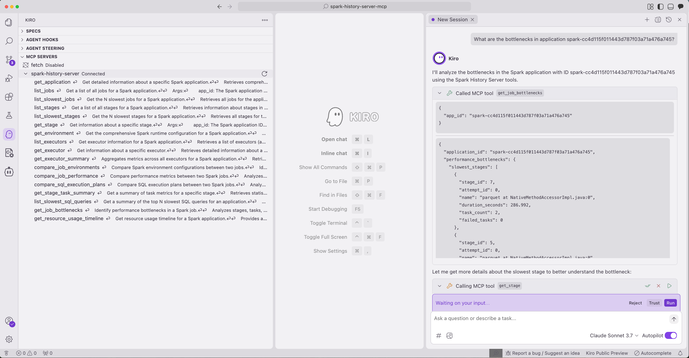

# Kiro IDE Integration

Connect Kiro IDE to Spark History Server for intelligent Spark analysis directly in your development environment.

## Prerequisites

1. **Download and Install Kiro:**
Follow the installation steps in the [public documentation](https://kiro.dev/docs/getting-started/installation/)

2. **Install `uv`** (used to run the MCP server):
```bash
# See https://docs.astral.sh/uv/getting-started/installation/ for all options
curl -LsSf https://astral.sh/uv/install.sh | sh
```
This is the only requirement for the MCP server itself — the `uvx` command in the [Setup](#setup) step downloads and runs the published package automatically. You do **not** need to clone this repository to use the integration.

### (Optional) Run a local Spark History Server with sample data

If you don't already have a Spark History Server to point at, you can start the bundled sample server. This is the only part that needs the repository and the [Task](https://taskfile.dev/installation/) runner:

```bash
git clone https://github.com/kubeflow/mcp-apache-spark-history-server.git
cd mcp-apache-spark-history-server

# Install Task (if not already installed)
brew install go-task  # macOS
# or see https://taskfile.dev/installation/ for other platforms

# Setup dependencies
task install

# Start Spark History Server at http://localhost:18080 with 3 sample applications
task start-spark-bg

# Verify it returns 3 applications
curl http://localhost:18080/api/v1/applications
```

## Setup

1. **Configure MCP server in Kiro**:

Follow the instructions listed here: https://kiro.dev/docs/mcp/

Create or edit the Kiro MCP configuration file at `.kiro/settings/mcp.json` in your workspace:

```json
{
  "mcpServers": {
    "spark-history-server": {
      "command": "uvx",
      "args": ["--from", "mcp-apache-spark-history-server", "spark-mcp"],
      "env": {
        "SHS_MCP__TRANSPORT": "stdio"
      },
      "disabled": false,
      "autoApprove": []
    }
  }
}
```

This runs the published package directly with [`uvx`](https://docs.astral.sh/uv/) — no repository clone, local path, or Task runner required. The server reads its server connections from a `config.yaml` in the working directory; pass an explicit path with `"args": ["--from", "mcp-apache-spark-history-server", "spark-mcp", "--config", "/absolute/path/to/config.yaml"]` if needed.

2. **Restart Kiro or reconnect MCP servers** from the Kiro feature panel.

## Usage

Once connected, you can interact with your Spark History Server directly in Kiro:



Example queries:
```
What are the bottlenecks in application spark-cc4d115f011443d787f03a71a476a745?

Compare performance between spark-cc4d115f011443d787f03a71a476a745 and spark-110be3a8424d4a2789cb88134418217b.

Show me the slowest stages in application spark-bcec39f6201b42b9925124595baad260.
```

## Advanced Configuration

### Remote Spark History Server

To connect to a remote Spark History Server, edit `config.yaml` in the repository:

```yaml
servers:
  production:
    default: true
    url: "https://spark-history-prod.company.com:18080"
    auth:
      username: "user"
      password: "pass"
```

### Multiple Spark History Servers

You can configure multiple Spark History Servers in your `config.yaml` and specify which one to use in your queries:

```yaml
servers:
  production:
    default: true
    url: "https://spark-history-prod.company.com:18080"
    auth:
      username: "user"
      password: "pass"
  staging:
    url: "https://spark-history-staging.company.com:18080"
    auth:
      username: "user"
      password: "pass"
```

Then in Kiro, you can specify which server to use:
```
Show me the slowest jobs in application app-123 using the staging server.
```

## Troubleshooting

- **Connection issues**: Ensure the Spark History Server is running and accessible
- **MCP server not responding**: Check the Kiro logs for connection errors
- **Missing data**: Verify that your Spark applications are properly registered in the History Server
